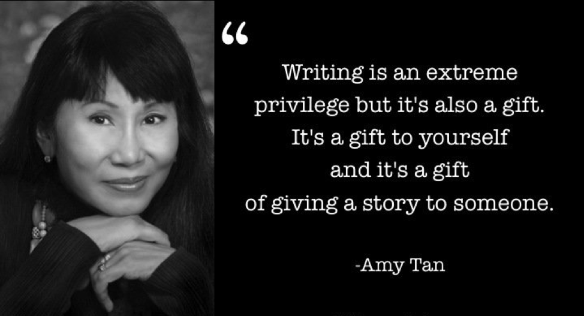

# Language and Identity

Have you ever thought about how language and identity are related? I bet you didn't. I know I didn't, at least until my English class.

Beside the fact, one of the biggest parts of your identity lies within language. It voices the inner monologue inside your head. It's how you communicate to others, how you're about to share your thoughts and feelings. They really do go hand in hand.

I know it may be difficult for some to relate to this, especially in the younger generation. Growing up, we all learn to speak English differently, or any other language for the matter. We struggle to fitting into an inherited culture and fall into an identity crisis as a result. In schools, students are emphasized in them the concept of Standard English. Standard English doesn't really exist. No one speaks standard english; we all speak with some sort of accent, no exceptions.

In Amy Tan's "Mother Tongue", she illustrates this concept with a story from her childhood. Tan highlights how people could not understand her mother's broken english but understood from her translations. She saw this identity crisis firsthand and knows it to be very real. But despite this, she proudly identifies herself as an Asian and an American. She speaks what many would consider "proper" english". She is a writer.

This is a common to all those around the world, to everyone who identifies themselves with a language of some sort. How do you struggle with this issue and what have you done that has allowed you to get by it?
